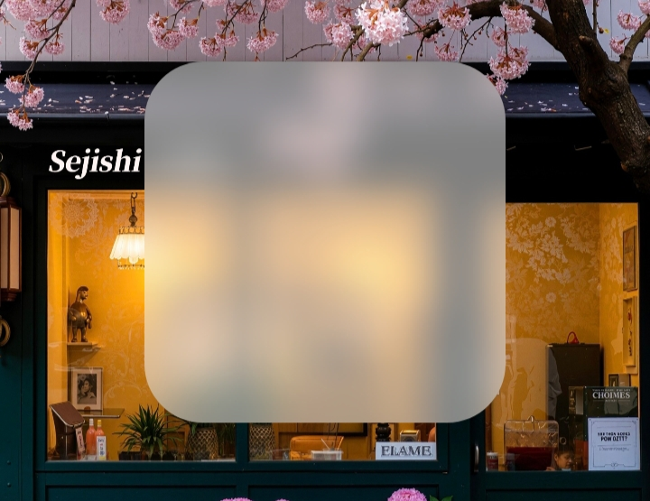
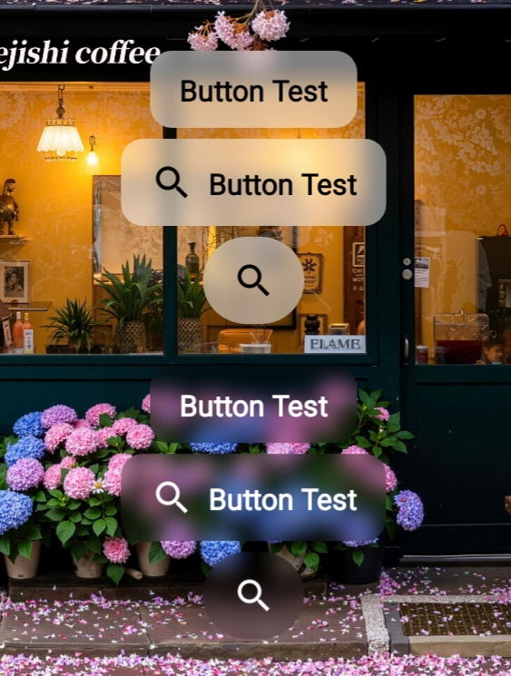
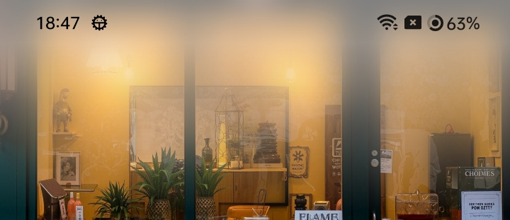
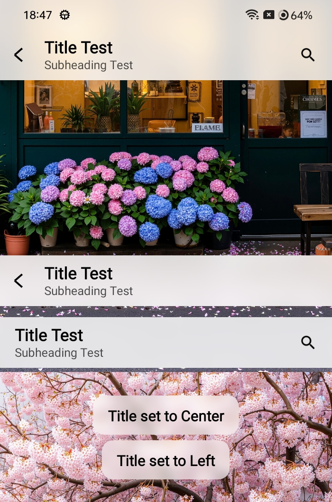
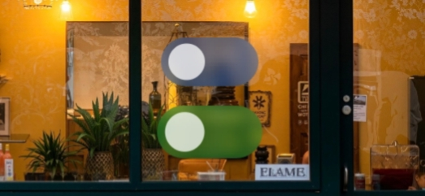
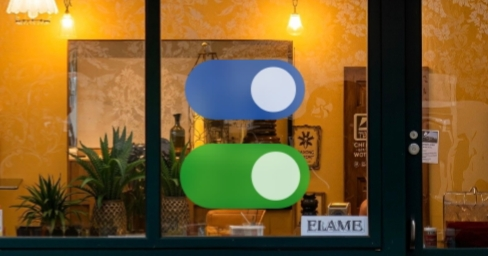
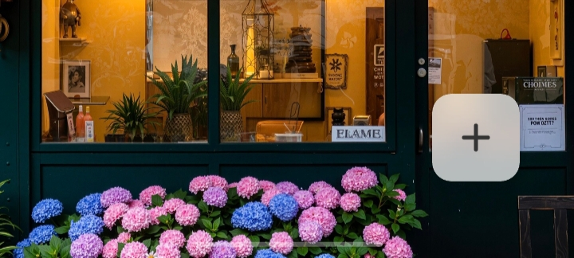

# QmBlurView is an Android UI component library that integrates a variety of blur effects, including BlurView, BlurButtonView, ProgressiveBlurView, BlurTitleBarView, BlurSwitchButtonView, and BlurFloatingButtonView

   

  
  
  
  

  
  

  
  
  
  
  

   
   

English | [简体中文](https://github.com/QmDeve/QmBlurView/blob/master/README_zh.md)

---

> **Note: Mirror Repository**
>
> This project is maintained on multiple platforms to facilitate developers in different regions. The content of all warehouses should be consistent
> - **Main Repository**：[GitHub](https://github.com/QmDeve/QmBlurView)
> - **Other Repository**：
>   - [GitLab](https://gitlab.com/QmDeve/QmBlurView)
>   - [Gitee](https://gitee.com/QmDeve/QmBlurView)
>   - [GitCode](https://gitcode.com/QmDeve/QmBlurView)

---

## Characteristic
- **View**
  - `BlurView`
  - `BlurViewGroup`
  - `BlurButtonView`
  - `ProgressiveBlurView`
  - `BlurTitlebarView`
  - `BlurSwitchButtonView`
  - `BlurFloatingButtonView`
- **Minimum support Android 5.0**
- **High Performance**: Native blur algorithm implemented with underlying `Native` calls
- **Automatic Recycling Mechanism**: Prevents memory leaks

---

## Screenshot
### BlurView

### BlurButtonView

### ProgressiveBlurView

### BlurTitleBarView

### BlurSwitchButtonView

### BlurFloatingButtonView

---

## Demo experience
[Download Demo](https://github.com/QmDeve/QmBlurView/blob/master/app/release/app-release.apk?raw=true)

---

## Quick use

**Usage: [Docs](https://blur.docs.qmdeve.com/)**

---

## Star History

---

## Contributors

---

### My other open-source library
- **[AndroidLiquidGlassView](https://github.com/QmDeve/AndroidLiquidGlassView)**
- **[QmReflection](https://github.com/QmDeve/QmReflection)**