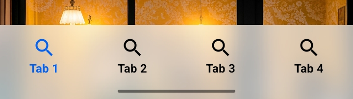

<div align="center">


## Bibliothèque de composants flous gaussiens de l'interface utilisateur Android

  <br>

[](https://GitHub.com/QmDeve/QmBlurView/)
[](https://gitlab.com/QmDeve/QmBlurView)

[](https://t.me/QmDeves)

  
  
  

  <br>
  <br>

[English](./README.md) | Français | [简体中文](./README_zh.md) | [Русский](./README_ru.md)

</div>

---

> **Note: Autres dépôts**
>
> Le projet est maintenu sur plusieurs plateformes pour la commodité des développeurs dans différentes régions. Le contenu de tous les entrepôts doit être cohérent
> - **Main Repo**：[GitHub](https://github.com/QmDeve/QmBlurView)
> - **Other Repo**：
>   - [GitLab](https://gitlab.com/QmDeve/QmBlurView)

---

## Caractéristique
- **View**
    - `BlurView` - Vue floue universelle
    - `BlurViewGroup`
    - `BlurButtonView` - Vue floue du bouton
    - `ProgressiveBlurView` - Vue floue progressive
    - `BlurTitlebarView` - Vue de la barre de titre floue
    - `BlurSwitchButtonView` - Vue du bouton de l'interrupteur flou
    - `BlurFloatingButtonView` - Vue floue du bouton flottant
    - `BlurBottomNavigationView` - Flou la vue de la barre de navigation inférieure
- **Prise en charge minimale pour Android 5.0**
- **Haute performance** : L'algorithme flou natif implémenté par l'appel sous-jacent `Native`
- **Mécanisme de récupération automatique** : prévenir les fuites de mémoire

---

## Aperçu des captures d'écran
### BlurView


### BlurButtonView


### ProgressiveBlurView


### BlurTitleBarView


### BlurSwitchButtonView


### BlurFloatingButtonView


### BlurBottomNavigationView


## De démonstration
**[Télécharger démonstration](./app/release/app-release.apk?raw=true)**

# Commencez à utiliser
### Intégration rapide


**Ajouter des dépendances au bloc `dependencies{}` du fichier `build.gradle`**
```gradle
// Dépendances de base
implementation 'com.qmdeve:QmBlurView:<Version>'

// BottomNavigationView Dependencies (v1.0.4.5-Beta02 and above)
implementation 'com.qmdeve:QmBlurView.BottomNavigation:<Version>'

// Transform Dependencies (v1.0.5-Beta02 and above)
implementation 'com.qmdeve:QmBlurView.Transform:<Version>'
```

## Comment utiliser
**Veuillez vérifier le document: [https://blur-docs.qmdeve.com](https://blur-docs.qmdeve.com/fr/)**

---

## Star History
[](https://starchart.qmdeve.com/QmDeve/QmBlurView)

---

## Collaborateur
<a href="https://github.com/QmDeve/QmBlurView/graphs/contributors">
  
</a>

## Mon projet open source
 - **[AndroidLiquidGlassView](https://github.com/QmDeve/AndroidLiquidGlassView)**
 - **[QmReflection](https://github.com/QmDeve/QmReflection)**
 - **[Qm Authenticator for Android](https://github.com/Rouneant/Qm-Authenticator-for-Android)**

## License
```
Copyright ©️ 2025 QmDeve

Permission is hereby granted, free of charge, to any person obtaining a copy
of this software and associated documentation files (the "Software"), to deal
in the Software without restriction, including without limitation the rights
to use, copy, modify, merge, publish, distribute, sublicense, and/or sell
copies of the Software, and to permit persons to whom the Software is
furnished to do so, subject to the following conditions:

The above copyright notice and this permission notice shall be included in all
copies or substantial portions of the Software.

THE SOFTWARE IS PROVIDED "AS IS", WITHOUT WARRANTY OF ANY KIND, EXPRESS OR
IMPLIED, INCLUDING BUT NOT LIMITED TO THE WARRANTIES OF MERCHANTABILITY,
FITNESS FOR A PARTICULAR PURPOSE AND NONINFRINGEMENT. IN NO EVENT SHALL THE
AUTHORS OR COPYRIGHT HOLDERS BE LIABLE FOR ANY CLAIM, DAMAGES OR OTHER
LIABILITY, WHETHER IN AN ACTION OF CONTRACT, TORT OR OTHERWISE, ARISING FROM,
OUT OF OR IN CONNECTION WITH THE SOFTWARE OR THE USE OR OTHER DEALINGS IN THE
SOFTWARE.
```