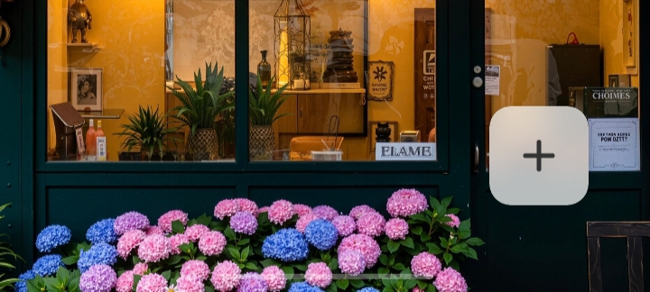

<div align="center">


## Библиотека нечетких компонентов пользовательского интерфейса Android

  <br>

[](https://GitHub.com/QmDeve/QmBlurView/)
[](https://gitlab.com/QmDeve/QmBlurView)

[](https://t.me/QmDeves)

  
  
  

  <br>
  <br>

[English](./README.md) | [Français](./README_fr.md) | [简体中文](./README_zh.md) | Русский

</div>

---

> **Note: Другие репозитории**
>
> Проект поддерживается на нескольких платформах для удобства разработчиков в разных регионах. Содержание всех складов должно быть одинаковым
> - **Основной Репозиторий**：[GitHub](https://github.com/QmDeve/QmBlurView)
> - **Другое Репозиторий**：
>   - [GitLab](https://gitlab.com/QmDeve/QmBlurView)

---

## Характеристика
- **View**
    - `BlurView` - Универсальный нечеткий вид
    - `BlurViewGroup`
    - `BlurButtonView` - Вид размытой кнопки
    - `ProgressiveBlurView` - Прогрессивный вид размытия
    - `BlurTitlebarView` - Размытый вид строки заголовка
    - `BlurSwitchButtonView` - Вид кнопки нечеткого переключателя
    - `BlurFloatingButtonView` - Нечеткий вид плавающей кнопки
    - `BlurBottomNavigationView` - Размытие нижней панели навигации
- **Минимальная поддержка Android 5.0**
- **Высокая производительность**: собственный нечеткий алгоритм, реализованный базовым вызовом `Native`
- **Автоматический механизм восстановления**: предотвращение утечки памяти

---

## предварительно просмотреть
### BlurView


### BlurButtonView


### ProgressiveBlurView


### BlurTitleBarView


### BlurSwitchButtonView


### BlurFloatingButtonView


### BlurBottomNavigationView


## Демонстрационный опыт
**[Скачать демо-версию](./app/release/app-release.apk?raw=true)**

# Начните использовать
### Быстрая интеграция


**Добавить зависимости в блок `dependencies{}` файла `build.gradle`**
```gradle
// Основные зависимости
implementation 'com.qmdeve:QmBlurView:<Version>'

// BottomNavigationView зависимости
implementation 'com.qmdeve:QmBlurView.BottomNavigation:<Version>'
```

## Как использовать
**Пожалуйста, проверьте документ: [https://blur.docs.qmdeve.com](https://blur.docs.qmdeve.com/ru/)**

---

## Star History
[](https://starchart.qmdeve.com/QmDeve/QmBlurView)

---

## Жертвователь
<a href="https://github.com/QmDeve/QmBlurView/graphs/contributors">
  
</a>

## License
```
Copyright 2025 QmDeve

Licensed under the Apache License, Version 2.0 (the "License");
you may not use this file except in compliance with the License.
You may obtain a copy of the License at

    http://www.apache.org/licenses/LICENSE-2.0

Unless required by applicable law or agreed to in writing, software
distributed under the License is distributed on an "AS IS" BASIS,
WITHOUT WARRANTIES OR CONDITIONS OF ANY KIND, either express or implied.
See the License for the specific language governing permissions and
limitations under the License.
```

## Мой проект с открытым исходным кодом
 - **[AndroidLiquidGlassView](https://github.com/QmDeve/AndroidLiquidGlassView)**
 - **[QmReflection](https://github.com/QmDeve/QmReflection)**
 - **[Qm Authenticator for Android](https://github.com/Rouneant/Qm-Authenticator-for-Android)**