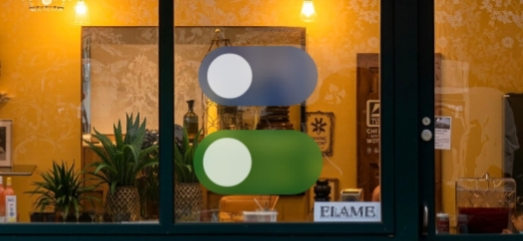

# QmBlurView - 一个集成了多种模糊效果的Android UI组件库，包括模糊视图 (BlurView)、模糊按钮 (BlurButtonView)、渐进模糊视图 (ProgressiveBlurView)、模糊标题栏 (BlurTitleBarView)、模糊切换按钮 (BlurSwitchButtonView) 和模糊悬浮按钮 (BlurFloatingButtonView)

   

  
  
  
  

  
  
  

  
  
  
  
  

   
   

[English](https://github.com/QmDeve/QmBlurView/blob/master/README.md) | 简体中文

---

> **Note: 镜像存储库**
>
> 该项目在多个平台上维护，以方便不同地区的开发人员使用。所有仓库的内容都应保持一致
> - **Main Repository**：[GitHub](https://github.com/QmDeve/QmBlurView)
> - **Other Repository**：
>   - [GitLab](https://gitlab.com/QmDeve/QmBlurView)
>   - [Gitee](https://gitee.com/QmDeve/QmBlurView)
>   - [GitCode](https://gitcode.com/QmDeve/QmBlurView)

---

## 特性
- **View**
  - `BlurView` - 通用模糊视图
  - `BlurButtonView` - 模糊按钮视图
  - `ProgressiveBlurView` - 渐进模糊视图
  - `BlurTitlebarView` - 模糊标题栏视图
  - `BlurSwitchButtonView` - 模糊切换按钮视图
  - `BlurFloatingButtonView` - 模糊悬浮按钮视图
- **最低支持 Android 5.0**
- **高性能**：底层调用 `Native` 实现的原生模糊算法
- **自动回收机制**：防止内存泄漏

---

## 截图
### BlurView

### BlurButtonView

### ProgressiveBlurView

### BlurTitleBarView

### BlurSwitchButtonView

### BlurFloatingButtonView

---

## Demo 体验
[下载 Demo](https://github.com/QmDeve/QmBlurView/blob/master/app/release/app-release.apk?raw=true)

---

## 如何使用
**请查看文档：[Docs](https://blur.docs.qmdeve.com/zh/)**

---

## Star History

---

## 贡献者

**我们希望有更多的贡献者一起维护这个项目**
 
**我的邮箱: me@qmdeve.com**

---

### 我的其他开源库
- **[AndroidLiquidGlassView](https://github.com/QmDeve/AndroidLiquidGlassView)**
- **[QmReflection](https://github.com/QmDeve/QmReflection)**

---

### 赞助我们

**如果您觉得我们的项目对您有帮助，欢迎通过以下方式赞助支持：**

