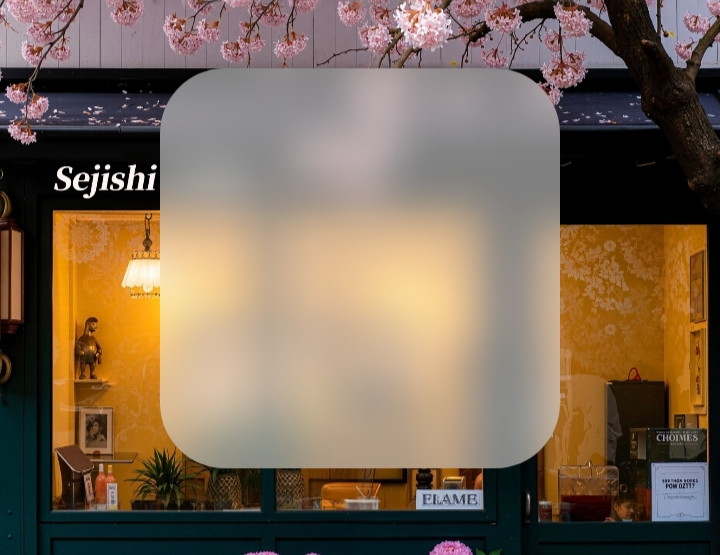
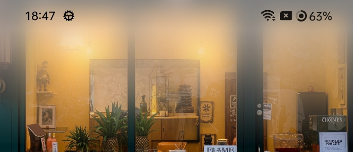

<div align="center">


## Android UI 高斯模糊组件库

  <br>

  [](https://GitHub.com/QmDeve/QmBlurView/)
  [](https://gitlab.com/QmDeve/QmBlurView)
  [](https://gitee.com/QmDeve/QmBlurView)
  [](https://gitcode.com/QmDeve/QmBlurView)

  [](https://t.me/QmDeves)
  [](https://qm.qq.com/q/OEVn8ZslMq)

  
  
  

  <br>
  <br>

[English](./README.md) | [Français](./README_fr.md) | 简体中文 | | [Русский](./README_ru.md)

</div>

---

> **Note: 其他存储库**
>
> 该项目在多个平台上维护，以方便不同地区的开发人员使用。所有仓库的内容都应保持一致
> - **主存储库**：[GitHub](https://github.com/QmDeve/QmBlurView)
> - **其他存储库**：
>   - [GitLab](https://gitlab.com/QmDeve/QmBlurView)
>   - [Gitee](https://gitee.com/QmDeve/QmBlurView)
>   - [GitCode](https://gitcode.com/QmDeve/QmBlurView)

---

## 特性
- **View**
  - `BlurView` - 通用模糊视图
  - `BlurViewGroup`
  - `BlurButtonView` - 模糊按钮视图
  - `ProgressiveBlurView` - 渐进模糊视图
  - `BlurTitlebarView` - 模糊标题栏视图
  - `BlurSwitchButtonView` - 模糊切换按钮视图
  - `BlurFloatingButtonView` - 模糊悬浮按钮视图
  - `BlurBottomNavigationView` - 模糊底部导航栏视图
- **最低支持 Android 5.0**
- **高性能**：底层调用 `Native` 实现的原生模糊算法
- **自动回收机制**：防止内存泄漏

---

## 预览
### BlurView


### BlurButtonView


### ProgressiveBlurView


### BlurTitleBarView


### BlurSwitchButtonView


### BlurFloatingButtonView


### BlurBottomNavigationView


## Demo 体验
**[下载 Demo](./app/release/app-release.apk?raw=true)**

# 开始使用
### 快速集成


**在 `build.gradle` 文件的 `dependencies{}` 块中添加依赖项**
```gradle
// 核心依赖项
implementation 'com.qmdeve:QmBlurView:<Version>'

// BottomNavigationView 依赖项
implementation 'com.qmdeve:QmBlurView.BottomNavigation:<Version>'
```

## 如何使用
**请查看文档：[https://blur-docs.qmdeve.com](https://blur-docs.qmdeve.com/zh/)**

---

## Star History
[](https://starchart.qmdeve.com/QmDeve/QmBlurView)

---

## 贡献者
<a href="https://github.com/QmDeve/QmBlurView/graphs/contributors">
  
</a>

## 我的开源项目
 - **[AndroidLiquidGlassView](https://github.com/QmDeve/AndroidLiquidGlassView)**
 - **[QmReflection](https://github.com/QmDeve/QmReflection)**
 - **[Qm Authenticator for Android](https://github.com/Rouneant/Qm-Authenticator-for-Android)**

---

## 赞助我们

**如果您觉得我们的项目对您有帮助，欢迎通过以下方式赞助支持：**


## License
```
Copyright ©️ 2025 QmDeve

Permission is hereby granted, free of charge, to any person obtaining a copy
of this software and associated documentation files (the "Software"), to deal
in the Software without restriction, including without limitation the rights
to use, copy, modify, merge, publish, distribute, sublicense, and/or sell
copies of the Software, and to permit persons to whom the Software is
furnished to do so, subject to the following conditions:

The above copyright notice and this permission notice shall be included in all
copies or substantial portions of the Software.

THE SOFTWARE IS PROVIDED "AS IS", WITHOUT WARRANTY OF ANY KIND, EXPRESS OR
IMPLIED, INCLUDING BUT NOT LIMITED TO THE WARRANTIES OF MERCHANTABILITY,
FITNESS FOR A PARTICULAR PURPOSE AND NONINFRINGEMENT. IN NO EVENT SHALL THE
AUTHORS OR COPYRIGHT HOLDERS BE LIABLE FOR ANY CLAIM, DAMAGES OR OTHER
LIABILITY, WHETHER IN AN ACTION OF CONTRACT, TORT OR OTHERWISE, ARISING FROM,
OUT OF OR IN CONNECTION WITH THE SOFTWARE OR THE USE OR OTHER DEALINGS IN THE
SOFTWARE.
```